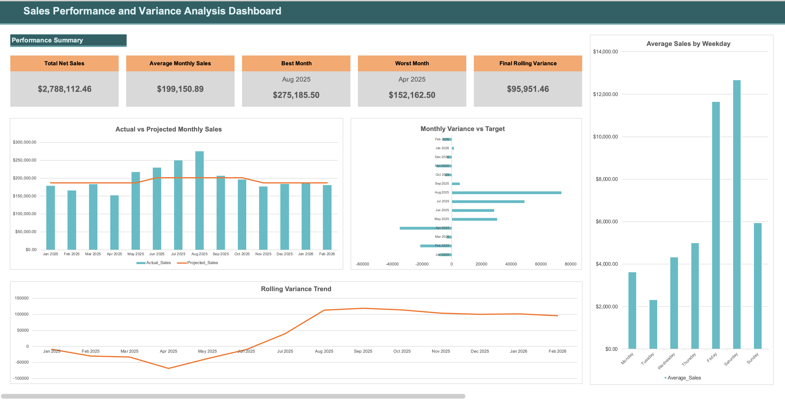
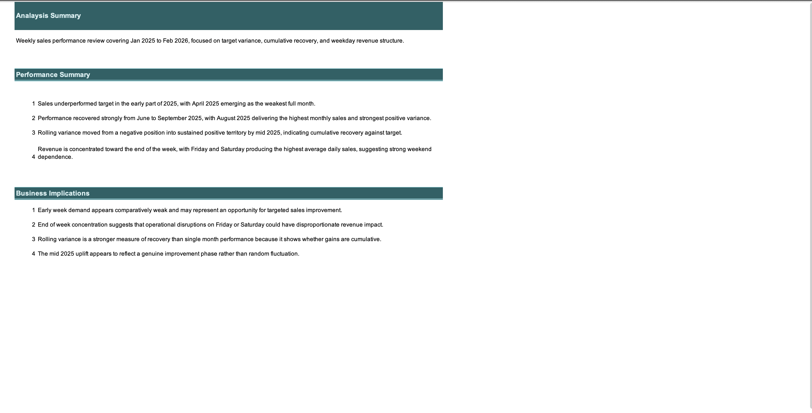

# Sales Performance and Variance Analysis Dashboard in Excel

## Overview
This project analyses weekly sales data from January 2025 to February 2026 and transforms it into a structured Excel dashboard for performance reporting. The focus is on comparing actual sales against projected targets, tracking variance trends, and identifying revenue patterns across time and weekdays.

---

## Objectives
- Clean and restructure raw weekly sales data  
- Aggregate weekly records into monthly performance summaries  
- Compare actual sales against projected targets  
- Track cumulative performance using rolling variance  
- Analyse weekday sales behaviour and revenue concentration  
- Present findings in a clear and structured Excel dashboard  

---

## Dataset
The source data consists of weekly sales records including:
- Week start and end dates  
- Daily sales from Monday to Sunday  
- Weekly totals  
- Percentage change values  
- Notes and commentary  
- Projected values and variance indicators  

---

## Methodology
- Cleaned and validated weekly sales data  
- Reconstructed daily dated sales entries from weekly records  
- Aggregated daily sales into monthly totals  
- Calculated monthly variance and rolling variance  
- Built KPI summaries and performance metrics  
- Designed Excel charts for trend and comparison analysis  
- Produced a separate analysis summary page with interpretation and insights  

---

## Dashboard Features
- Total Net Sales  
- Average Monthly Sales  
- Best Month  
- Worst Month  
- Final Rolling Variance  
- Actual vs Projected Monthly Sales  
- Monthly Variance vs Target  
- Rolling Variance Trend  
- Average Sales by Weekday  

---

## Key Findings
- Sales underperformed target in early 2025, with April 2025 as the weakest full month  
- Strong recovery occurred between June and September 2025, peaking in August 2025  
- Rolling variance moved from negative into sustained positive territory by mid 2025  
- Revenue is concentrated toward the end of the week, with Friday and Saturday as the strongest days  

---

## Business Implications
- Early week demand presents an opportunity for targeted improvement  
- End of week performance is critical to overall revenue  
- Rolling variance provides a clearer picture of recovery than single month results  
- Mid 2025 performance suggests a genuine recovery phase rather than random fluctuation  

---

## Tools Used
- Microsoft Excel  
- Data cleaning and restructuring  
- Aggregation and summary analysis  
- Charting and dashboard design  
- Business performance reporting  

---

## Screenshots
### Dashboard Overview

### Analysis Summary

---

## Author
Nnaemeka Sinclaire Ndubuisi
